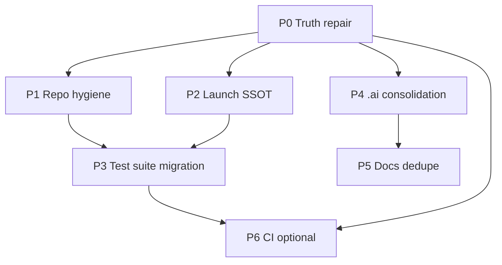

# Workspace Refactor Plan

---
last_updated: 2026-05-19
updated_by: refactor-plan-discovery
status: PLAN_ONLY
purpose: Phased refactor roadmap for `/home/ahmed/ardupilot_workspace` (no implementation in this document)
---

## Executive summary

**Current state:** The workspace is a multi-tree ArduPilot + Gazebo Harmonic simulation lab centered on writable project `src/SIM_ARD_GAW/`, with upstream vendored trees (`src/ardupilot/`, `src/ardupilot_gazebo/`, `src/SITL_Models/`) and a large AI knowledge base (`.ai/`, 141 files). Core vehicles (`iris_with_lidar`, `mini_talon`, `mini_talon_with_lidar`) are documented as **WORKING** in `.ai/README.md` (2026-05-12). Wind-matrix CTE campaigns (logs `017`–`021`, ~13 GB under `src/SIM_ARD_GAW/logs/`) and a Phase-1 `scripts/test_suite/` plugin framework wrap legacy runners (`run_one.py`, `run_matrix.py`, `run_matrix_round_robin.py`) without retiring them. A truth audit (`.tmp_ai_truth_audit/`) found **5 critical** and **11 high** doc/code mismatches; **2,456** log paths are git-tracked while `.gitignore` does not exclude campaign artifacts.

**Top 5 problems**

1. **Operational lies** — `wind-check-altitude` in `launch.sh:935-938` calls missing `scripts/wind_altitude_log_check.py`; logger paths advertise non-existent `logs/flights/` (`launch.sh:689,699`, `log_flight_data.py:44`).
2. **Knowledge-base drift** — Missing session files (`2026-05-11_001`, `2026-05-12_001`), contradictory gear status (matrix vs `CURRENT.md`), stale `.cursorrules` (fixed-wing “NOT WORKING” vs `.ai` “WORKING”).
3. **Dual test stacks** — Legacy wind runners + `test_suite` wrappers; `test_phase1_parity.py` covers CLI flags only, not live SITL parity (`test_suite/ARCHITECTURE.md:101-103`).
4. **Repo hygiene** — ~13 GB `logs/`, 2,456 tracked files under `logs/`, no `src/SIM_ARD_GAW/logs/` gitignore; nested `src/SIM_ARD_GAW/.git/` ignored at repo root.
5. **Documentation sprawl** — Parallel trees: `src/SIM_ARD_GAW/docs/` (24 files), `.ai/features/*` (6 feature areas), duplicate lane docs (`docs/SIMULATION_LANES.md` vs `.ai/architecture/SIMULATION_LANES.md`); broken ref `architecture/TEST_SUITE.md` in `features/wind_matrix/60_TEST_SUITE_INTEGRATION.md:6`.

**Recommended approach:** **Phased incremental refactor** (not big-bang). Rationale: working sim baselines, active wind-matrix campaigns, and Phase-1 test-suite parity in flight (`logs/phase1_live_rr_parity_test/`). P0 truth repair unlocks safe doc/script changes; P1–P2 stabilize repo and entrypoints; P3–P5 converge tests and knowledge; P6 optional automation.

**Quick wins (< 1 day each):** Fix/remove `wind-check-altitude`; align logger default dir with numbered `logs/NNN_*` convention; update `.cursorrules` vehicle table; bulk-rename stale `plane_lidar_runway.sdf` references in `.ai/`; add `src/SIM_ARD_GAW/logs/**` to `.gitignore` (after git rm --cached policy decision).

---

## Architecture target

```
┌─────────────────────────────────────────────────────────────────────────────┐
│                    WORKSPACE: ardupilot_workspace                            │
├─────────────────────────────────────────────────────────────────────────────┤
│  .ai/                          │  Human + agent knowledge (links to code)   │
│    architecture/  PATHS,COMMANDS│  sessions/, issues/, features/ (thin)      │
│    planning/     THIS FILE      │  reconciliation/ → merge or archive      │
├────────────────────────────────┴────────────────────────────────────────────┤
│  setup.bash  ──► env: ARDUPILOT_HOME, GZ_SIM_*, PYTHON venv                 │
├─────────────────────────────────────────────────────────────────────────────┤
│  src/SIM_ARD_GAW/  (OWNED — single product surface)                         │
│    launch.sh ──► SITL / Gazebo / bridges / utilities (SSOT for commands)      │
│    models/ worlds/ config/  (SSOT for simulation assets)                    │
│    scripts/                                                                 │
│      test_suite/  ──► campaigns (plugins: wind_matrix, future…)             │
│      legacy/      ──► run_*.py (deprecated wrappers → test_suite CLI)       │
│      bridges/     ──► lidar_bridge_unified.py, wind_publisher_altitude.py   │
│    logs/          ──► gitignored artifacts; numbered milestones + campaigns   │
│    docs/          ──► operator guides only (install, troubleshoot, lanes)   │
├─────────────────────────────────────────────────────────────────────────────┤
│  src/ardupilot/          READ-ONLY (+ .ai/external_mods/ if patched)        │
│  src/ardupilot_gazebo/   READ-ONLY (+ plugin docs/patches)                  │
│  src/SITL_Models/        READ-ONLY reference models/worlds                 │
│  build/ install/ env/    gitignored tooling                                   │
│  archive/                gitignored heavy evidence (BIN, tlog)              │
└─────────────────────────────────────────────────────────────────────────────┘

Data flow (unchanged intent, clearer ownership):
  Gazebo (models/worlds) ←UDP 9002 JSON→ ArduPilot SITL ←TCP 5760→ MAVProxy
       ↑ LiDAR topic                              ↑ DISTANCE_SENSOR (14550)
  lidar_bridge_unified.py ─────────────────────────┘
  wind_publisher_altitude.py → Gazebo wind topic (altitude-wind lane)
```

| Layer | Owner | SSOT |
|-------|-------|------|
| Launch commands | `src/SIM_ARD_GAW/scripts/launch.sh` | Case labels; help text |
| Paths / ports | `.ai/architecture/PATHS.md` | Links only; no duplicate path tables |
| Parameters | `src/SIM_ARD_GAW/config/*.parm` | `.ai/vehicles/*/PARAMETERS.md` describes stacks |
| Campaign execution | `scripts/test_suite/cli/*.py` | `.ai/features/wind_matrix/` describes design |
| Upstream patches | `.ai/external_mods/` | Patches under `external_mods/patches/` when needed |

---

## Phase breakdown

### P0 — Truth repair (audit CRITICAL + blocking HIGH)

| Field | Value |
|-------|-------|
| **ID** | P0 |
| **Name** | Truth repair |
| **Goal** | Docs, commands, and scripts match filesystem; no broken launch targets |
| **Risk** | Medium (wrong param doc could misconfigure SITL) |
| **Prerequisites** | None |
| **Effort** | L (3–5 days) |

**Files/dirs touched**

- `src/SIM_ARD_GAW/scripts/launch.sh` (`wind-check-altitude`, logger messages)
- `src/SIM_ARD_GAW/scripts/wind_altitude_log_check.py` (create **or** remove target)
- `src/SIM_ARD_GAW/scripts/log_flight_data.py:44,641,665`
- `.ai/external_mods/SUMMARY.md`, `.ai/external_mods/ardupilot_gazebo/ArduPilotPlugin/airspeed_json.md`
- `.ai/architecture/COMMANDS.md`, `PATHS.md`, `QUICK_START.md`, `SIMULATION_LANES.md`
- `.ai/issues/RESOLVED.md`, `OPEN.md`; `.ai/sessions/` (missing files)
- `.ai/vehicles/quadcopter/STATUS.md`, `.ai/vehicles/fixed_wing/{STATUS,ISSUES,MODELS}.md`
- `.ai/reconciliation/MASTER_STATUS_MATRIX.md`
- `.ai/tests/airspeed_claim_test_matrix.md`; `src/SIM_ARD_GAW/worlds/bench_s1_airspeed.sdf:13`
- `.cursorrules:27-32` (stale vehicle status)
- `.ai/features/airspeed/80_OPEN_ISSUES.md` (airspeed_bridge claim)

**Tasks**

1. **C-002 / C-013:** Decide: implement `wind_altitude_log_check.py` (minimal BIN validator using `audit_bin_internal_wind.py` patterns) **or** remove `wind-check-altitude` from `launch.sh:935-938` and all `.ai` command tables.
2. **C-003 / C-008:** Replace all “`ARSPD_TYPE=100` in `plane_base.parm`” with “`plane_airspeed.parm` overlay” — verify `config/plane_base.parm:46` (`ARSPD_TYPE 0`) vs `config/plane_airspeed.parm:8`.
3. **C-001:** Mark `airspeed_bridge.py` as superseded in `.ai/features/airspeed/80_OPEN_ISSUES.md`; remove “✅ Created” if present.
4. **C-004:** Create stub session logs `2026-05-11_001.md`, `2026-05-11_002.md`, `2026-05-12_001.md` from `issues/RESOLVED.md` + `external_mods` content **or** retarget all references to `2026-03-30_001.md` with explicit note.
5. **C-005 / C-007:** Reconcile `bench_s1_airspeed.sdf:13` sign with `.ai/tests/airspeed_claim_test_matrix.md` and sensor pose in `models/mini_talon_with_airspeed/model.sdf` — one source of truth for expected `diff_pressure` sign.
6. **H-003:** Resolve landing gear: align `MASTER_STATUS_MATRIX.md:42` (`DEPRECATED_ARCHIVE`) with `sessions/CURRENT.md:36-37,57` (`Deferred`) — **assumption:** user decision 2026-05-12 “abandoned” wins; update `CURRENT.md` and close GEAR-001/002 as archived.
7. **H-004:** Replace `logs/flights/` with documented convention: default logger output → `logs/006_Plane_FlightLogger/` or new `logs/flight_logger/` + README in `logs/`.
8. **H-005:** Replace remaining `plane_lidar_runway.sdf` path refs in `.ai/templates/*`, `.ai/vehicles/fixed_wing/ISSUES.md:63`, `.ai/issues/RESOLVED.md:156` (historical sessions may keep “formerly named” notes).
9. **H-006, H-007, H-001:** Fix quadcopter exclusivity wording; update `RESOLVED.md` / matrix frontmatter dates.
10. **H-009:** Restore `config/full_auto_mission_v7.waypoints` from archive **or** amend LAND-001/002/003 resolution text.
11. **H-011:** Document param stack: `plane_base.parm` → `plane_airspeed.parm` → `.private/config/plane_params.local.parm` in `.ai/features/airspeed/60_LAUNCH_AND_PARAMS.md:32`.
12. **`.cursorrules`:** Sync vehicle status with `.ai/README.md:22-27`.

**Verification**

```bash
source ~/ardupilot_workspace/setup.bash
cd ~/ardupilot_workspace/src/SIM_ARD_GAW/scripts
./launch.sh wind-check-altitude   # expect: runs OR prints "removed" in help only
grep -r "plane_base.parm.*ARSPD_TYPE.*100" .ai/   # expect: no matches
grep -r "logs/flights" .ai/architecture/ .ai/QUICK_START.md  # expect: updated paths
grep -r "plane_lidar_runway\.sdf" .ai/ --include='*.md' | grep -v sessions/ | grep -v CHANGELOG  # expect: zero active refs
test -f .ai/sessions/2026-05-11_001.md || test ! grep -q 2026-05-11_001 .ai/issues/RESOLVED.md
```

**Rollback:** Git revert doc/script commits; keep backup branch before param-doc edits.

---

### P1 — Repo hygiene (gitignore, logs policy, nested git)

| Field | Value |
|-------|-------|
| **ID** | P1 |
| **Name** | Repo hygiene |
| **Goal** | Stop accidental commit of campaign artifacts; clarify retention |
| **Risk** | High if `git rm --cached` done carelessly (history size) |
| **Prerequisites** | P0 command truth (logger path decided) |
| **Effort** | M (1–2 days) + optional XL for history cleanup |

**Files/dirs touched**

- `.gitignore`
- `src/SIM_ARD_GAW/logs/` (policy doc only)
- `src/SIM_ARD_GAW/.git/` (nested repo — **fact:** listed in root `.gitignore:25`)
- `.private/` (add gitignore if not present — **fact:** not in root `.gitignore` today)

**Tasks**

1. Add to `.gitignore`:
   - `src/SIM_ARD_GAW/logs/**/runs/`
   - `src/SIM_ARD_GAW/logs/**/scripts/round_robin_logs/`
   - `src/SIM_ARD_GAW/logs/phase1_*/`
   - `src/SIM_ARD_GAW/logs/**/*.BIN` `**/*.tlog` `**/*.tlog.raw`
   - Keep tracked: `logs/*/TEST_RESULT_*.md`, `ARCHITECTURE.md`, summary JSON/CSV at campaign root (explicit allowlist).
2. Document retention in `src/SIM_ARD_GAW/logs/README.md`: numbered milestones vs campaign dirs vs `archive/`.
3. Run `git ls-files src/SIM_ARD_GAW/logs | wc -l` (baseline: **2456**); `git rm -r --cached` for patterns above after human approval.
4. Add `.private/` to `.gitignore` (local parm overrides referenced in H-011).
5. Resolve nested `src/SIM_ARD_GAW/.git/` — remove nested repo or document why it exists.

**Verification**

```bash
git check-ignore -v src/SIM_ARD_GAW/logs/018_New_Param_Full_CTE_Matrix/some.bin  # expect: ignored
git ls-files src/SIM_ARD_GAW/logs | wc -l   # expect: << 2456 (milestone docs only)
du -sh src/SIM_ARD_GAW/logs                 # information only (~13G on disk OK)
```

**Rollback:** Restore `.gitignore`; `git add -f` specific files if over-ignored.

---

### P2 — `launch.sh` + command SSOT

| Field | Value |
|-------|-------|
| **ID** | P2 |
| **Name** | Launch surface consolidation |
| **Goal** | One obvious operator surface; `launch.sh` ≤ maintainable size |
| **Risk** | Medium (break muscle memory on target names) |
| **Prerequisites** | P0 (dead targets removed) |
| **Effort** | L (4–6 days) |

**Facts**

- `launch.sh`: **955 lines**, **30** case labels (`launch.sh:795-951`).
- Aliases: `plane-airspeed` → `plane-cte` (`835-839`); `gazebo-plane-wind` → `gazebo-plane-cte` (`886-889`).
- `gazebo-plane-wind-sea-level` is **not** an alias (separate world `mini_talon_wind_runway_sea_level.sdf`) — audit M-002.

**Files/dirs touched**

- `src/SIM_ARD_GAW/scripts/launch.sh`
- `src/SIM_ARD_GAW/scripts/launch.d/` (new — suggested)
- `.ai/architecture/COMMANDS.md`, `PATHS.md`, `SIMULATION_LANES.md`
- `src/SIM_ARD_GAW/docs/SIMULATION_LANES.md`
- `setup.bash` aliases (optional: point to `launch.sh`)

**Tasks**

1. Split `launch.sh` into `launch.d/{copter,plane,utility}.sh` sourced by thin dispatcher; keep case labels stable.
2. Generate **Launch Target Catalog** table for `.ai/architecture/COMMANDS.md` from `launch.sh --help` (scripted extraction).
3. Add `launch.sh doctor` — checks: env vars, plugin path, required scripts, world files exist.
4. Wire wind-matrix campaigns through documented wrapper:
   - `./launch.sh matrix-case --x 4 --y 4` → `python -m test_suite.cli.run_case` (after P3).
5. Deduplicate: merge `docs/SIMULATION_LANES.md` into `.ai/architecture/SIMULATION_LANES.md`; leave stub in `docs/` linking to `.ai`.

**Verification**

```bash
./launch.sh help | grep -c 'plane-'    # stable count
./launch.sh doctor                      # all checks pass
./launch.sh plane & sleep 5; ./launch.sh cleanup   # SITL starts/stops
```

**Rollback:** Single-file `launch.sh` from git tag.

---

### P3 — Test suite migration (legacy → plugins)

| Field | Value |
|-------|-------|
| **ID** | P3 |
| **Name** | Test architecture convergence |
| **Goal** | `test_suite` owns campaign lifecycle; legacy scripts become thin wrappers |
| **Risk** | High (campaign regressions) |
| **Prerequisites** | P0, P1 (clean logs layout); P2 optional |
| **Effort** | XL (2–4 weeks) |

**Facts**

- Phase 1 complete in tree: `scripts/test_suite/` (44 files), plugin registry: `wind_matrix` only (`cli/_registry.py:16-18`).
- `test_suite/ARCHITECTURE.md` defines phases 2–5 (lines 115-142): split `run_one.py`, second plugin, retire legacy.
- Parity test: `tests/test_phase1_parity.py` — CLI flags only, imports legacy modules.
- Live parity campaign exists: `logs/phase1_live_rr_parity_test/` (2026-05-19 artifacts).

**Files/dirs touched**

- `src/SIM_ARD_GAW/scripts/run_one.py`, `run_matrix.py`, `run_matrix_round_robin.py`, `run_one_og.py`
- `src/SIM_ARD_GAW/scripts/test_suite/**`
- `src/SIM_ARD_GAW/tests/test_phase1_parity.py`
- `.ai/features/wind_matrix/60_TEST_SUITE_INTEGRATION.md` (fix broken `architecture/TEST_SUITE.md` link → `scripts/test_suite/ARCHITECTURE.md`)

**Tasks**

1. **Gate:** Complete live parity checklist from `test_suite/ARCHITECTURE.md` (runtime-proven).
2. **Phase 2** (per ARCHITECTURE.md:115-119): additive manifest fields; dual-read manifest.
3. **Phase 3** (lines 122-132): extract wind stimulus/analyzers from `run_one.py` into plugin modules; remove `LegacyDelegateAttemptStrategy`.
4. Address open wind issues before cutover: WM-003, WM-006–WM-009 (`.ai/features/wind_matrix/80_OPEN_ISSUES.md`).
5. Deprecation: `run_one.py` → 5-line shim calling `python -m test_suite.cli.run_case`.
6. Add `launch.sh` targets for matrix suite (optional).
7. Expand tests: manifest round-trip, scheduler policy, one integration test with mocked `launch_sitl`.

**Verification**

```bash
cd ~/ardupilot_workspace/src/SIM_ARD_GAW
source ~/ardupilot_workspace/setup.bash
python -m pytest tests/test_phase1_parity.py -v
python -m test_suite.cli.run_case --x 4 --y 4 --rep 1 --dry-run  # if supported
# Full: one live case matching phase1_live_rr_parity_test acceptance criteria
```

**Rollback:** Keep `run_one_og.py`; feature flag `SIM_ARD_USE_LEGACY=1`.

---

### P4 — `.ai/` consolidation

| Field | Value |
|-------|-------|
| **ID** | P4 |
| **Name** | Knowledge base consolidation |
| **Goal** | Smaller, truthful `.ai/` with clear roles per directory |
| **Risk** | Low–medium |
| **Prerequisites** | P0 |
| **Effort** | L (3–5 days) |

**Files/dirs touched**

- `.ai/README.md` (directory tree L-001–L-006)
- `.ai/reconciliation/MASTER_STATUS_MATRIX.md` (add wind-matrix track M-001)
- `.ai/features/*` (6 areas: airspeed, airspeed_lidar_integrated, altitude_wind, lidar, wind_matrix, _TEMPLATE)
- `.ai/sessions/CURRENT.md`
- `.tmp_ai_truth_audit/` → merge into `.ai/planning/TRUTH_AUDIT_2026.md` then archive

**Tasks**

1. Update `.ai/README.md` tree: `reconciliation/`, all `features/`, `planning/`, GEAR issue files.
2. Add **Wind Matrix / CTE** row to `MASTER_STATUS_MATRIX.md` (tracks 017–021, phase1 parity).
3. Establish doc tiers:
   - **Tier A (normative):** `architecture/`, `vehicles/*/STATUS.md`, `issues/OPEN.md`
   - **Tier B (feature design):** `features/<name>/00_SCOPE`, `STATUS.md`
   - **Tier C (historical):** `sessions/`, `logs/*/TEST_RESULT_*`, evidence/raw
4. Move `features/airspeed/scripts/` to `src/SIM_ARD_GAW/scripts/airspeed_evidence/` or keep but link from PATHS.md (L-012 undeclared paths).
5. Resolve `sessions/CURRENT.md` “deferred gear” vs matrix “abandoned” (same as P0).
6. Import audit appendix: finding → phase mapping (see Appendix B).

**Verification**

```bash
find .ai -name '*.md' -exec grep -l 'plane_lidar_runway' {} \;  # only historical/session files
test -f .ai/planning/TRUTH_AUDIT_2026.md
```

**Rollback:** N/A (docs only).

---

### P5 — Docs dedupe (`docs/` ↔ `.ai/features/`)

| Field | Value |
|-------|-------|
| **ID** | P5 |
| **Name** | Documentation deduplication |
| **Goal** | Operators read `docs/`; agents read `.ai/`; no conflicting lane/test docs |
| **Risk** | Low |
| **Prerequisites** | P4 |
| **Effort** | M (2–3 days) |

**Facts**

- `src/SIM_ARD_GAW/docs/wind_matrix_scripts/` (11 files) overlaps `.ai/features/wind_matrix/` (10+ files).
- Blueprint: `docs/wind_matrix_scripts/08_automated_test_suite_blueprint.md` ↔ `scripts/test_suite/ARCHITECTURE.md`.

**Tasks**

1. **Rule:** `docs/` = install, troubleshooting, flight modes, lane quick-reference; `.ai/features/` = design + evidence index.
2. Merge `docs/wind_matrix_scripts/00_script_inventory.md` into `.ai/features/wind_matrix/20_RUNNERS.md` (single inventory table).
3. Keep blueprint in one place: `scripts/test_suite/ARCHITECTURE.md` canonical; `docs/.../08_*.md` becomes stub pointer.
4. Align `docs/INSTALLATION.md` with `setup.bash` and `build/ardupilot_gazebo` path in `setup.bash:28`.
5. Archive superseded plans under `docs/archive/` (report generation, old modularization).

**Verification:** Manual review checklist; no duplicate “canonical stack” tables in two places.

**Rollback:** Restore moved files from git.

---

### P6 — CI, pre-commit, packaging (optional)

| Field | Value |
|-------|-------|
| **ID** | P6 |
| **Name** | Automation |
| **Goal** | Prevent regression of truth + parity |
| **Risk** | Low |
| **Prerequisites** | P0, P3 (tests meaningful) |
| **Effort** | M (2–3 days) |

**Tasks**

1. GitHub Actions / local `make check`: `pytest tests/`, `ruff` or `flake8` on `scripts/test_suite/`, link checker for `.ai/` (paths exist).
2. Pre-commit: block `*.BIN`, `*.tlog`, `logs/**/runs/` additions.
3. `scripts/validate_launch_targets.sh` — every `launch.sh` case has existing handler/files.
4. Optional: package `test_suite` as installable module in `env/`.

**Verification:** CI green on PR; intentional broken path fails check.

**Rollback:** Disable workflow.

---

## Dependency graph



---

## Migration map (legacy → new)

| Legacy path/command | Target | Deprecation window |
|---------------------|--------|--------------------|
| `python scripts/run_one.py --x X --y Y` | `python -m test_suite.cli.run_case --x X --y Y` | Keep shim through P3; remove after live parity + 1 campaign |
| `python scripts/run_matrix.py` | `python -m test_suite.cli.run_suite` | Same |
| `python scripts/run_matrix_round_robin.py` | `python -m test_suite.cli.run_round_robin` | Same |
| `scripts/run_one_og.py` | Archive to `scripts/legacy/run_one_og.py` | After P3 Phase 3 |
| `logs/flights/` (logger) | `logs/flight_logger/` or `logs/006_Plane_FlightLogger/` | P0 |
| `./launch.sh wind-check-altitude` | Implemented script or removed | P0 |
| `.ai/features/airspeed` “Python airspeed bridge” | Native ArduPilotPlugin JSON | Immediate doc-only |
| `docs/wind_matrix_scripts/*` deep design | `.ai/features/wind_matrix/*` | P5 |
| `plane_lidar_runway.sdf` (doc refs) | `mini_talon_lidar_runway.sdf` | P0 |
| `models/mini_talon_backup/` (PATHS claim) | `archive/models/mini_talon_backup/` | P4 PATHS update |
| Dual `SIMULATION_LANES.md` | `.ai/architecture/SIMULATION_LANES.md` only | P2/P5 |
| `.cursorrules` status table | Mirror `.ai/README.md` | P0 |

---

## Risk register

| Risk | Mitigation |
|------|------------|
| Wind-matrix campaign regression during P3 | Keep legacy scripts; parity test + one live case per release; `run_one_og.py` backup |
| `git rm --cached` logs breaks clones | Publish `logs/README.md` + fetch script for archived BINs; milestone markdown stays tracked |
| Param doc fix causes wrong airspeed stack | Grep verification; test `plane-cte` arm sequence; never edit `plane_base.parm` for ARSPD_TYPE |
| `launch.sh` split breaks operators | No rename of case labels; `doctor` command; deprecation warnings only |
| Upstream drift in `src/ardupilot` | No broad refactors; pin commit hash in `.ai/architecture/OVERVIEW.md` (**open question**) |
| Sign convention fix (C-005) invalidates old evidence | Version the test matrix; note change in `bench_s1_airspeed.sdf` comment block |
| 13 GB logs on disk | P1 gitignore only; optional tarball to `archive/` |

---

## Open questions (need human decision)

1. **`wind_altitude_log_check.py`:** Implement validator vs remove launch target entirely?
2. **Landing gear:** Confirm **abandoned** (matrix) vs **deferred** (CURRENT) — affects GEAR-001/002 and `models/mini_talon_landing_gear/`.
3. **`full_auto_mission_v7.waypoints`:** Restore from backup or mark LAND resolutions as “file lost”?
4. **Git history:** Run `git filter-repo` to purge tracked logs (~2456 files) or only stop future tracking?
5. **Upstream pin:** Should workspace record required `ardupilot` / `ardupilot_gazebo` commit SHAs?
6. **Nested `src/SIM_ARD_GAW/.git/`:** Intentional submodule substitute or accident to delete?
7. **`.tmp_ai_truth_audit/`:** Merge into `.ai/planning/` and delete, or keep as external audit snapshot?
8. **Sinusoidal wind claim (audit C-012):** Update historical `logs/003_.../TEST_RESULT` or add errata only?

---

## Appendix A — Inventories (verified 2026-05-19)

### A.1 `launch.sh` targets (30 cases)

`copter`, `copter-lidar`, `gazebo-copter`, `gazebo-copter-lidar`, `bridge-copter`, `plane`, `plane-cte`, `plane-airspeed`, `plane-lidar`, `plane-staircase`, `plane-airspeed-lidar`, `plane-altitude-wind`, `plane-rebuild`, `gazebo-plane`, `gazebo-plane-lidar`, `gazebo-plane-cte`, `gazebo-plane-wind`, `gazebo-plane-wind-sea-level`, `gazebo-plane-rebuild`, `gazebo-plane-rebuild-wind`, `gazebo-plane-bench`, `gazebo-plane-staircase`, `gazebo-plane-airspeed-lidar`, `gazebo-plane-altitude-wind`, `bridge-plane`, `wind-publisher-altitude`, `wind-check-altitude` (**broken**), `logger`/`log`, `logger-csv`, `cleanup`/`clean`, `help`.

### A.2 `scripts/*.py` (top-level, 14 files)

| Script | Role |
|--------|------|
| `launch.sh` | Dispatcher (not `.py`) |
| `run_one.py` | Single wind-matrix attempt (legacy) |
| `run_one_og.py` | Original backup |
| `run_matrix.py` | Sequential 16-combo |
| `run_matrix_round_robin.py` | Round-robin scheduler |
| `lidar_bridge_unified.py` | Copter + plane LiDAR MAVLink bridge |
| `wind_publisher_altitude.py` | Altitude-wind lane |
| `log_flight_data.py` | MAVLink logger |
| `true_path_deviation.py` | CTE analyzer |
| `square_loiter_mission_metrics.py` | Mission metrics |
| `compare_square_attempts.py` | Cross-attempt compare |
| `compare_campaign_mission_window.py` | Campaign window compare |
| `audit_bin_internal_wind.py` | BIN wind audit gate |
| `build_square_postprocessing_report.py` | Campaign reports |
| `airspeed_claim_probe.py` | Airspeed probe utility |
| `cleanup.sh` | Process cleanup helper |

**Missing (documented):** `wind_altitude_log_check.py`, `airspeed_bridge.py`.

### A.3 `test_suite/` layout

- `cli/`: `run_case.py`, `run_suite.py`, `run_round_robin.py`, `_registry.py`
- `core/`: 14 modules (attempt_runner, suite_runner, manifest, scheduler, …)
- `plugins/wind_matrix/`: 6 modules
- `ARCHITECTURE.md`: phases 1–5 roadmap

### A.4 Models (active under `models/`)

`iris_with_lidar`, `mini_talon`, `mini_talon_with_lidar`, `mini_talon_with_airspeed`, `mini_talon_airspeed_lidar`, `mini_talon_altitude_wind`, `mini_talon_landing_gear`, `mini_talon_rebuild`, `wind_sensor_probe`, `wind_sitl_probe`.  
**Archive:** `archive/models/mini_talon_backup/` (not `models/mini_talon_backup/` per PATHS.md).

### A.5 Worlds (14 SDF files)

`iris_runway.sdf`, `iris_lidar_obstacles.sdf`, `mini_talon_runway.sdf`, `mini_talon_lidar_runway.sdf`, `mini_talon_lidar_bench.sdf`, `mini_talon_lidar_staircase.sdf`, `mini_talon_wind_runway.sdf`, `mini_talon_wind_runway_sea_level.sdf`, `mini_talon_wind_bench.sdf`, `bench_s1_airspeed.sdf`, `mini_talon_rebuild_still_air.sdf`, `mini_talon_rebuild_wind.sdf`, `mini_talon_airspeed_lidar/wind_staircase.sdf`, `mini_talon_altitude_wind/runway.sdf`.

### A.6 Config (`config/`)

`plane_base.parm`, `plane_airspeed.parm`, `plane_lidar.parm`, `staircase_plane_params.parm`, `plane_params_rebuild.parm`, `copter_params.parm`, lane `plane_full.parm` files, `archive/`, `recovered_009_param_stack_7439211/`.

### A.7 Log directories (top-level)

`001_Quad_LiDAR` … `021_Sensor_Failure_Injection`, `017_*`, `018_*`, `019_*`, `020_*`, `phase1_live_rr_parity_test`.  
**No** `logs/flights/` on disk. **~13 GB** total size. **2456** git-tracked paths under `logs/`.

### A.8 `.ai/features/` areas

`lidar`, `airspeed`, `airspeed_lidar_integrated`, `altitude_wind`, `wind_matrix`, `_TEMPLATE`.

### A.9 Upstream trees

| Path | In `.gitignore` | Notes |
|------|-----------------|-------|
| `src/ardupilot/` | yes | Vendored |
| `src/SITL_Models/` | yes | Reference |
| `src/ardupilot_gazebo/` | no | Built to `build/ardupilot_gazebo` |
| No `.gitmodules` | — | Plain directories |

### A.10 Tests

| Location | Files |
|----------|-------|
| `src/SIM_ARD_GAW/tests/` | `test_phase1_parity.py` only |
| `scripts/test_suite/` | No dedicated unit tests beyond parity |

---

## Appendix B — Audit finding → phase mapping

| ID | Severity | Phase | Action summary |
|----|----------|-------|----------------|
| C-001 | Critical | P0, P4 | Remove/supersede airspeed_bridge claims |
| C-002 | Critical | P0 | Implement or remove `wind-check-altitude` |
| C-003 | Critical | P0 | Fix ARSPD_TYPE file attribution |
| C-004 | Critical | P0 | Create or retarget session files |
| C-005 | Critical | P0 | Reconcile diff_pressure sign |
| H-001 | High | P0, P4 | Fix matrix `last_updated` |
| H-002 | High | P0, P4 | Absolute path for archive BIN |
| H-003 | High | P0, P4 | Gear status single truth |
| H-004 | High | P0, P1 | Logger / docs log path |
| H-005 | High | P0 | Rename stale world refs |
| H-006 | High | P0 | Quadcopter exclusivity wording |
| H-007 | High | P0 | RESOLVED.md metadata |
| H-008 | High | P0, P4 | Remove ArduPilotPlugin.hh ref |
| H-009 | High | P0 | Waypoints file restore or errata |
| H-010 | High | P4 | T07 evidence index |
| H-011 | High | P0 | Document local parm override |
| M-001 | Medium | P4 | Wind matrix matrix track |
| M-002 | Medium | P2, P5 | sea-level lane not alias |
| M-003 | Medium | P0 | RESOLVED metadata (dup H-007) |
| M-004 | Medium | P4 | Issue prefix table |
| M-005 | Medium | P4 | GEAR archival note in OPEN.md |
| M-006–M-014 | Medium | P0–P5 | Per finding text in FINDINGS.md |
| L-001–L-012 | Low | P4–P5 | README tree, templates, PATHS completeness |
| C-012 | Critical* | P0 open Q8 | Sinusoidal wind vs SDF — needs physics decision |
| `.cursorrules` stale | High* | P0 | Not in audit; discovered in discovery |

\*C-012 from CONTRADICTIONS.md (log vs `mini_talon_wind_runway.sdf`).

---

## Effort summary

| Phase | Effort | Calendar (est.) |
|-------|--------|-----------------|
| P0 | L | 3–5 days |
| P1 | M (+ optional XL history) | 1–2 days |
| P2 | L | 4–6 days |
| P3 | XL | 2–4 weeks |
| P4 | L | 3–5 days |
| P5 | M | 2–3 days |
| P6 | M | 2–3 days |
| **Total (P0–P5)** | | **~6–8 weeks** part-time |

---

## Related artifacts

- Truth audit: `.tmp_ai_truth_audit/FINDINGS.md`, `CONTRADICTIONS.md`
- Test suite design: `src/SIM_ARD_GAW/scripts/test_suite/ARCHITECTURE.md`
- Active work: `.ai/sessions/CURRENT.md`
- Proposed audit fixes (reference): `.tmp_ai_truth_audit/PROPOSED_FIX_PLAN.md`

---

*This document is plan-only. Implementation belongs in separate sessions per phase, with session logs per `.ai/README.md` protocol.*
